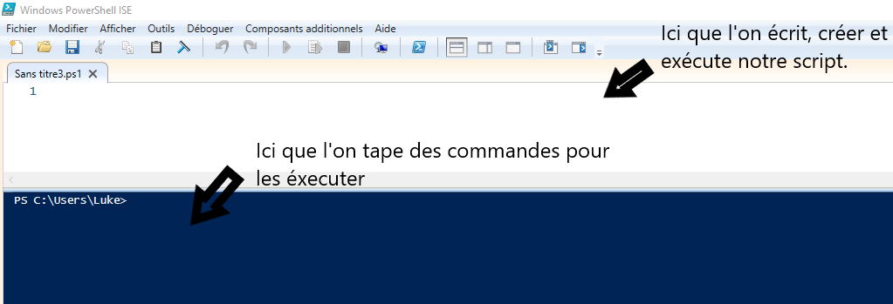
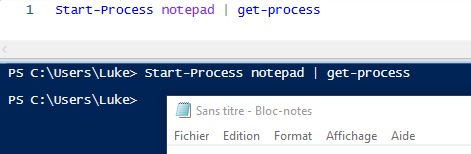

# Les scripts

**Un script PowerShell** n'est rien de plus qu'un simple fichier texte. Le fichier contient des commandes PowerShell, chaque commande apparaissant sur une ligne distincte. Pour que le fichier texte soit traité comme un script PowerShell, on doit utiliser **Powershell ISE** . 

**Powershell ISE** (Integrated Scripting Environment) est comme le powershell de base mais avec ISE. Dans ISE on peut executer des commandes mais aussi écrire, tester des scripts et ISE affichera le résultat. 

**Voici une image de Powershell ISE :** 

**Voci un exemple de script dans powershell ISE :**

