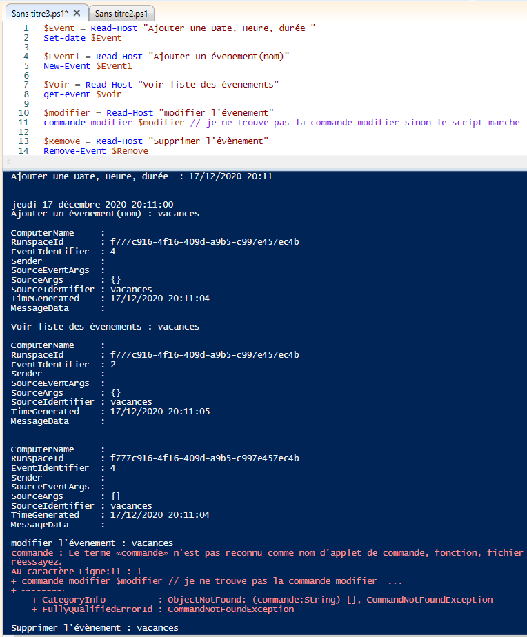

# Créer un agenda 

**Les consignes du script sont :** 
>**Le script devra permettre de gérer un agenda. Il devra inclure les fonctionnalités suivantes :**
-ajouter un évènement (date + heure + nom + durée)
-voir la liste des évènements par ordre chronologique
-modifier un évènement
-supprimer un évènement
-L'ensemble des informations devront être enregistrées dans un fichier texte

## Défénir les commandes 

- Premièrement nous allons défénir ce que sont les commandes au-dessus :

> **1- ajouter un évènement (date + heure + durée) ->** ***"Set-date"***
> 
> **2- ajouter un évènement(nom) ->** ***"New-Event"***
> 
> **3- voir la liste des évènements par ordre chronologique ->** ***"get-event"***
> 
> **4- modifier un évènement ->** ***"?"***
> 
> **5- supprimer un évènement ->** ***"Remove-Event"*** 

---
## Le script

