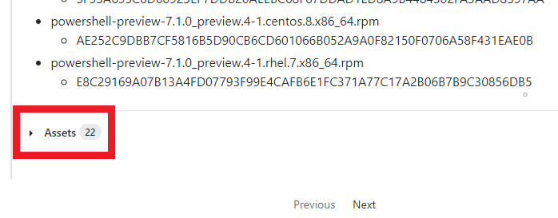
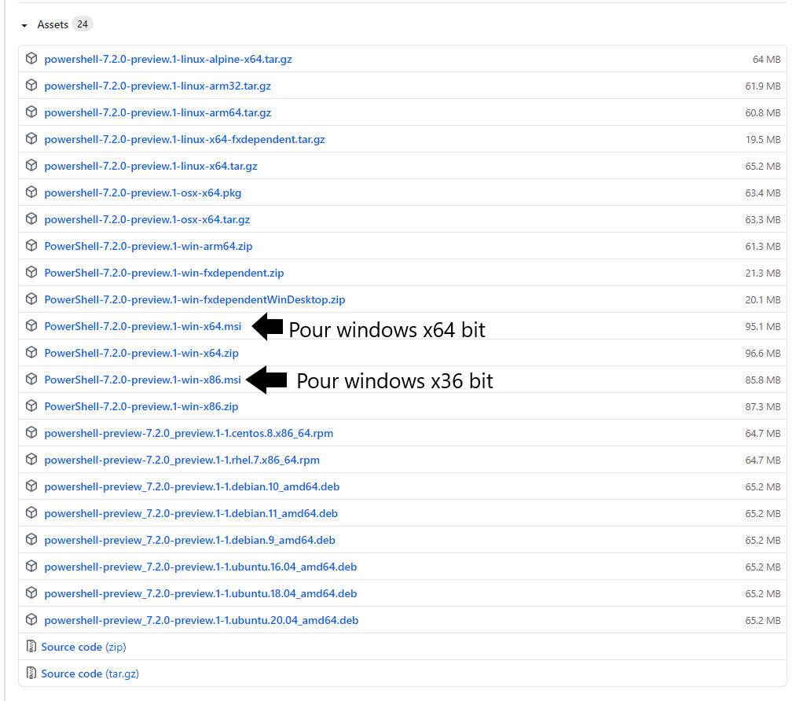

# Comment installer Powershell sur Windows :
-**Si dans une situation vous n'avez pas powershell sur Windows où vous voulez le mettre à jour, voici comment l'installer :**

- **1er étape -> suivre le lien du github ci-dessous :**
>https://github.com/PowerShell/powershell/releases
- **2ème étape -> Une fois sur le github, il faut descendre tout en bas de la page de la version la plus récente et il sera écrit "assets"**
>

- **3ème étape -> Cliquer sur "assets" et il y aura une page avec des liens d'installation.** 

> 

- **4ème étape -> Une fois que vous avez cliquer sur un des liens (où j'ai mis mes flêches), vous aurez un télechargement qui va ce lancer. Il faudra cliquer sur le télechargement une fois terminer. Vous pourrez suivre les étapes et powershell sera installer (où mis à jour pour ceux qui l'on déjà).**
 
---
# Comment installer Powershell sur Linux plus precisement Debian 10 :

-**Nous allons le faire via un dépôt de packages dans Debian 10** : 

- **1er étape -> Télécharger le répertoire clés GPG de Microsoft**
> wget https://packages.microsoft.com/config/debian/10/packages-microsoft-prod.deb

- **2eme étape -> Inserer le répertoire clés GPG de Microsoft**
>sudo dpkg -i packages-microsoft-prod.deb

- **3eme étape -> Il faut mettre à jour la liste des produits**
>sudo apt-get update

- **4eme étape -> Installer Powershell**
>sudo apt-install -y powershell

- **Dernière étape -> lancer powershell**
>pwsh 
