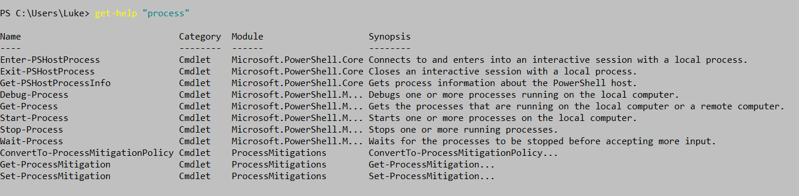

# Les commandes d'aides
## Les diverses manières d'utiliser la commande "Help" : 
- **Première manière**, il faut taper dans Powershell la commande suivante :

> Get-Help

-> Cette commande annoncera à quoi elle sert et comment on peut obtenir cette aide :
> 

-> Pour que la commande **Get-help** fonctionne il faut d'abord taper la commande ci-dessous : 
>Update-Help

-Cette commande va télécharger et installer les fichiers d'aide sur l'ordinateur.

- **Deuxième manière**,  la commande suivante :
> Get-Help "le nom de la commande" -online 

-> Cette commande (Get-Help "nom de la commande" -online) nous donnera des explications précises pour le nom la commande demandée sur le site de Microsoft en ligne. 

- **On peut aussi écrire cette commande sans le "-online" à la fin :**
> Get-Help "le nom de la commande"

-> Cela nous donnera donc des explications pour le nom de la commande mais sur Powershell. Voici un exmple :

>

