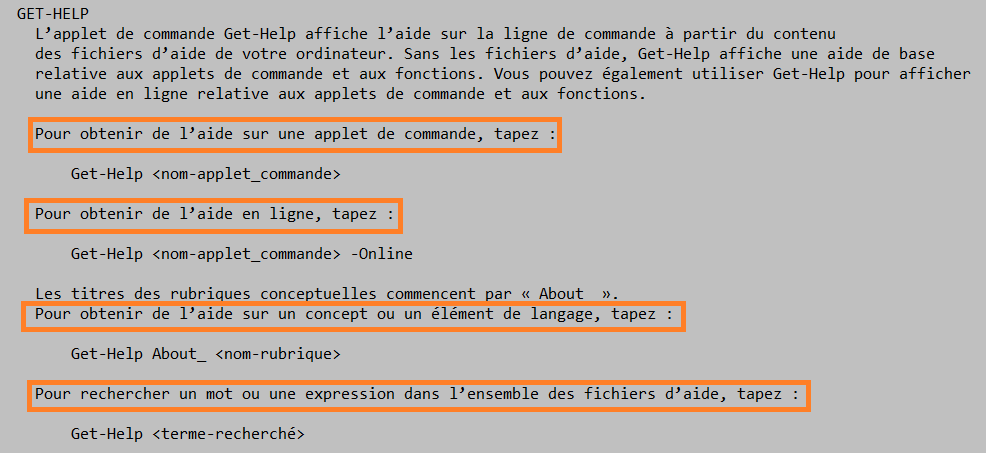
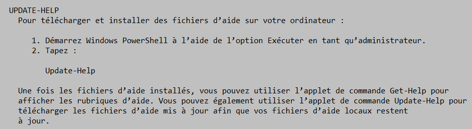
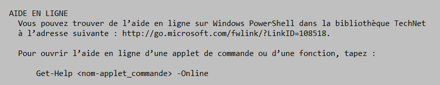

# Les commandes d'aides
####Il y a plusieurs façon pour avoir de l'aide pour les commandes que l'on ne comprend pas : 
- **Première manière** pour avoir de l'aide avec les commandes, il faut taper dans Powershell, la commande suivante :

> Get-Help

-> Cette commande expliquera à quoi elle sert et ensuite comment obtenir de l'aide grâce à cette commande :
> 

-> Pour que la commande **Get-help** fonctionne il faut d'abord faire la commande : 
>Update-Help

-Cette commande va télécharger et installer les fichiers d'aide sur l'ordinateur

- **Deuxième manière**, utiliser la commande suivante :
> Get-Help "le nom de la commande" -online

->Cette commande va nous envoyer sur le site de Microsoft en ligne et aura des explications pour utiliser la commande **get-help**