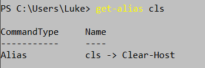
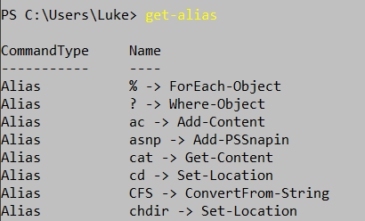

## Les alias de commande
-> **Les alias** vont nous permettre d'ecrire une commande plus facilement, rapidement mais sert principalement à créer un nom alternatif pour une commande disponible dans Powershell.
Voici un exemple :

- **get-alias** < name > **:** cela va permettre de nous donner la definition d'un alias specifique

Puis si on veut toute la liste des alias, la commande est :
- **get-alias :** ce qui donne toute la liste des alias disponible sur powershell

Exemple d'alias :

 