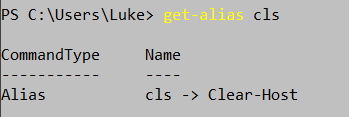
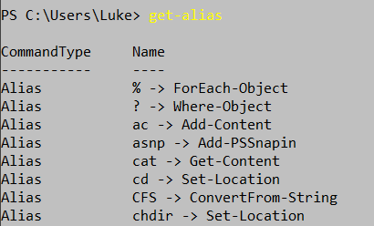

## Les commandes :

- **Start-Transcript :** c'est la première chose a taper quand on utilise powershell donc tout ce que l'on tape ou affiche apparaitra grace a cette commande 
  

- **Get-command** ***-noun < le mot ou lettre >*** **:** cela permet de trouver les commandes les plus important dispo dans powershell
- **Get-help < get-service (exemple de commande)>:** comme le dit la commande c'est pour de l'aide avec les autres commandes disponible 
  
- **Get-servive :** liste tout les services disponible avec le status, le nom et le nom d'affichage 

- **get-alias** < name > **:** cela va permettre de nous donner la definition d'un alias 

- **get-alias :** ce qui donne toute la liste des alias disponible sur powershell

 
- **get-process :** cela donne la liste des applications qui sont en cours d'utilisation et disponible. Si on veut que selectionner une seul appli, il faut mettre **-Name Discord** (exemple).

 
- get-process -Name Discord **| get-member :** cela va montrer toute les propriétés et toutes les methodes associés à des objets spécifiques

 
- get-process -Name Discord **| select-object * :** cette commande va nosu permettre de voir les propriétes de Discord donc le nom, l'identifiant, ect ...

 
- **(symbole dollar) luke = get-process Discord :** ici on a creé une variable nommé "$luke" qui va prendre un objet "get-process Discord"

 
- **cd\ :** nous ramene au debut du document
- **ipconfig :** cela permet de voir nos adresses IP, ect

 
- **get-history :** on peut voir toute les commandes utilisées 