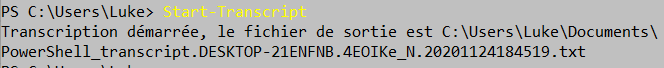
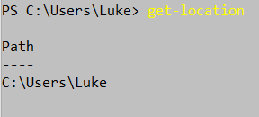
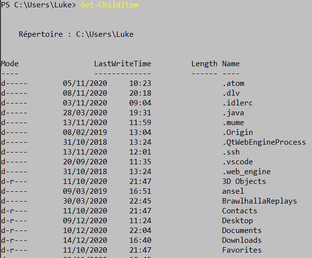
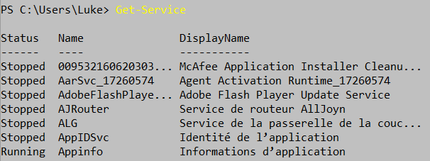
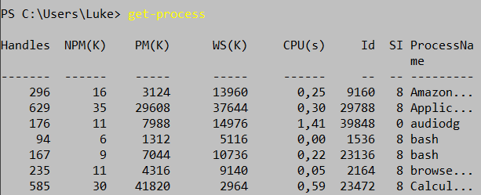
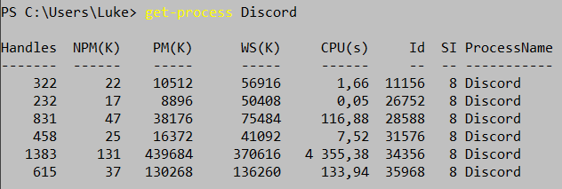
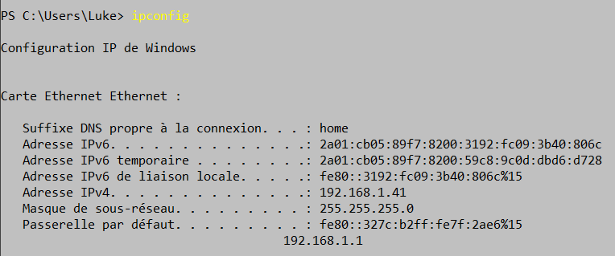

# Les commandes dans Powershell:

- **Start-Transcript :** c'est la première chose a taper quand on utilise powershell donc tout ce que l'on tape ou affiche apparaitra grace a cette commande 
  

---
- **Get-command** ***-noun < le mot ou lettre >*** **:** cela permet de trouver les commandes les plus important disponible dans powershell
  
---
-**Get-location :** nous montre ou nous sommes situé 

---
-**Get-Childitem :** affiche le contenu d'un dossier
Il a un alias qui est **"dir"**

---
  
- **Get-servive :** liste tout les services disponible avec le status, le nom et le nom d'affichage 

---
- **Get-process :** cela donne la liste des applications qui sont en cours d'utilisation et disponible. Si on veut que selectionner une seule application, il faut mettre **-Name Discord** (exemple).

 
- Get-process -Name Discord **| get-member :** cela va montrer toute les propriétés et toutes les methodes associés à des objets spécifiques

 
- Get-process -Name Discord **| select-object * :** cette commande va nous permettre de voir les propriétées de Discord donc le nom, l'identifiant, ect ...

 
- **(symbole dollar) luke = Get-process Discord :** ici on a creé une variable nommé "$luke" qui va prendre un objet "get-process Discord"

 

---
-**New-item :** 

---
- **cd\ :** nous ramene au debut du document

---
- **ipconfig :** cela permet de voir nos adresses IP, ect

 

---
- **get-history :** on peut voir toute les commandes utilisées 