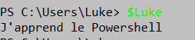
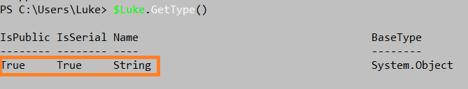
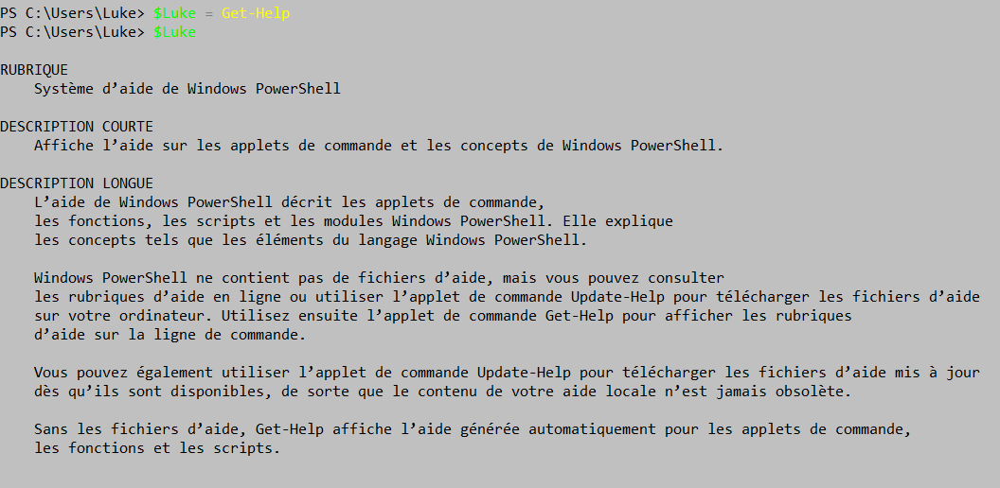

# Les variables 

**Une variable** va permettre de stocké une donnée et ensuite de manipuler cette donnée.

**->** Pour déclarer une varaible, il faut ajouter le symbole "**$**" et pour que la variable ai un nom il faut mettre "un dollar" suivi "d'un nom "; Exemple :
>**$Luke**

Donc ici ma variable s'appelle "Luke".

**->** Si on veut que notre variable ai une valeur il suffira d'ajouter le symbole égal ( = ) puis de mettre entre guillemets ( "" ) le texte que l'on veut.
La variable prendra donc pour valeur le texte que l'on a mit entre guillemets; Exemple :
> **$Luke = "J'apprend le Powershell"**

**->** Donc quand on tape dans Powershell **$Luke** la variable affiche :
> 

La variable affiche donc le texte que j'ai mit auparavant ! :)

**-> Pour supprimer une variable, voici la commande:** 
> Remove-variable -name luke 

**-> Pour effacer une variable, voici la commande:**
> Clear-variable -name luke

---
## Le type de la variable 

**->** Si l'on veut savoir le type d'une variable il suffit juste de taper :
> **$Luke.GetType()**

Cela affiche que c'est de type **string**:
> 

**->** On peut aussi forcer le type de variable en mettant **[string]** : 
> **[string]$Luke = "J'apprend le Powershell**

---
##Les différents type de variable 

->

---
## Stocker une commande dans une variable 

**->** On peut stocker une commande dans une variable avec la commande ci-dessous :
>**$Luke = Get-Help**

La variable nommé **"Luke"** affichera donc le contenu de la commande **Get-Help** :
> 

