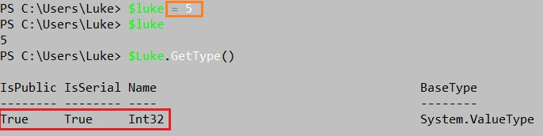
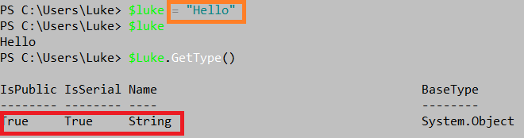
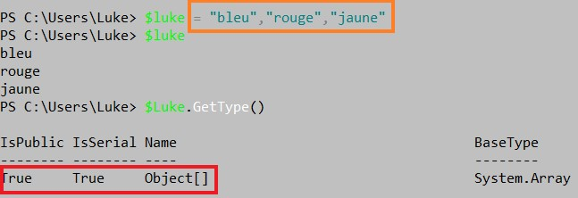
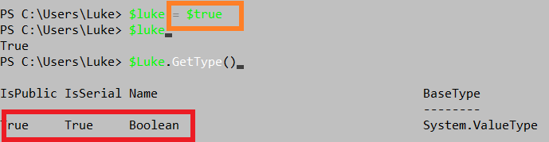

# Les variables 

**Une variable** permet de stocké une donnée et ensuite de manipuler cette donnée.

**->** Pour déclarer une varaible, il faut ajouter le symbole "**$**" et pour que la variable ai un nom il faut mettre "un dollar" suivi "d'un nom "; Exemple :
>**$Luke**

Donc ici ma variable s'appelle "Luke".

**->** Si on veut que notre variable a une valeur, il suffira d'ajouter le symbole égal ( = ) puis de mettre entre guillemets ( "" ) le texte que l'on veut.
-La variable prendra donc pour valeur le texte qu'on a mit entre guillemets; Exemple :
> **$Luke = "J'apprend le Powershell"**

**->** Donc quand on tape dans Powershell **$Luke** la variable affiche :
> 

La variable affiche donc le texte que j'ai mit auparavant ! :)

**-> Pour supprimer une variable, voici la commande:** 
> Remove-variable -name luke 

**-> Pour effacer une variable, voici la commande:**
> Clear-variable -name luke

---
## Le type de la variable 

**->** Si l'on veut savoir le type d'une variable il suffit juste de taper :
> **$Luke.GetType()**

Cela affiche que le type présent (dans le cadre orange) est de type **string** :
> 

**->** On peut aussi forcer le type de variable en mettant **[string]** : 
> **[string]$Luke = "J'apprend le Powershell"**

---
##Les différents type de variable 

-> De type **"int"** donc un entier (ex: 2, 7)
> 

- En orange l'entier et en rouge le type de l'entier 

-> De type **"string"** donc un mot ou une phrase (ex: Hello)
>  
-  En orange le mot et en rouge le type du mot.

-> De type **"array"** donc un tableau de string ou int; ex :
> 
- En orange un tableau de string et en rouge le type donc un tableau.
  
-> De type **"boolean"** donc soit vrai soit faux; exemple :
> 
- En orange le bool est vrai et en rouge le type.
---
## Stocker une commande dans une variable 

**->** On peut stocker une commande dans une variable avec la commande ci-dessous :
>**$Luke = Get-Help**

La variable nommé **"Luke"** affichera donc le contenu de la commande **Get-Help** :
> 

