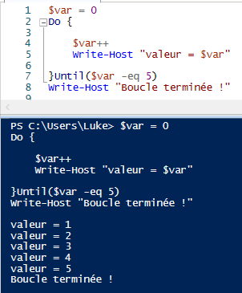

# Les boucles 
### Une boucle dans un programme d’ordinateur est une séquence d'instructions qui sont répètées jusqu’à ce qu’une condition soit atteinte. 
###### Voici mes sources :https://www.it-connect.fr/powershell-et-les-boucles-foreach/
---
## 1- Boucles For 
-> La syntaxe d'une boucle For : 
>**For(<état initial>;<condition de répétition>;<incrémation>)**
> 
> **{** 
> 
> **// si la condition est vraie, on éxecute le bloc au-dessus**    
> 
> **}**
> 
> **// si la condition est fausse, la boucle For se termine et le script continue**

-> Si je detail le bloc:

-**L'état initial** sera une valeur de départ (ex : 2, 6)

-**La condition** de répétiton est de répéter la boucle jusqu'a ce que la valeur qu'on ai mit atteint le maximum qu'elle peut faire.

-**L'incrémentation**, c'est ici que l'on va préciser combien (une valeur) on va ajouter à notre valeur chaque tour (ex : +x soit +1, +2).
###Voici les conditions d'une boucle For : 

- **Exemple 1 : Boucle For simple** 
>

-Le cadre en orange est comme ce que l'on a vu au début sauf que ici j'ai mis un exemple. C'est notre script de la BoucleFor.

-Le cadre en rouge est le résultat de notre script éxecuter.

- **Example 2 : Boucle For de type texte (string)**
>

**Si je détail ce que j'ai mis dans le cadre orange :**

**Ma variable** -> "couleur", contient dans un tableau différentes couleurs. (ligne 1)

**Ma boucle For** -> ma variable "i" = 0; "i" plus petit que ma variable "couleur" qui est de longueur du tableau donc 5; on ajoute 1 à chaque tour "i++ = i + 1". (ligne 2)

**->**  cela veut dire que notre variable "i" va récuperer la valeur que l'on veut dans le tableau de la variable "couleur" pour que chaque tour on aura une valeur différente.

Les valeurs différentes sont dans le cadre rouge.

- **Example 3 : Boucle For à double condition avec "and"**

**Si je détail le script :**
-> Nous avons créer un tableau de valeur qui va de 0 à 10 (ligne 1)

-> Une autre variable "couleur", qui est un tableau qui contient différentes couleurs. (ligne 3)

**La boucle For ->** Pour mes variables "i" et "j" (**valeur initial**) qui sont égal à 0; "i" plus petit que 10 et ("and" dans le script) "j" plus petit que la longueur du tableau de "couleur"; i++ et i++.

-> Ici la condition **"and"** doit dire que les 2 conditions ci-dessous  doivent être vrai sauf que la conditon "j" à dépacer la longueur du tableau, la condition est donc devenu fausse. Ce qui veut dire que la boucle est fausse est s'arrète à 4 (comme dans le cadre rouge juste au-dessus). 

- **Example 4 : Boucle For à double condition avec "or"**

-> Même système que avec la condition "and" sauf avec "or" (cadre rouge) les conditions sont vrai.

-> Donc la condition "i" va aller jusqu'au 10ème tour de la boucle et "j" jusqu'à la longueur du tableau "couleur". On peut le voir dans le cadre orange.

## 2-Boucle ForEach 

## 3-Boucle DoUntil

- Une Boucle DoUntil ce décrit de la façon suivante :
> **Do {"code"} Until("la condition soit vraie")**
> 
- Do = Faire et Until = Jusqu'a ce que , donc le code veut dire : 
>**Joue ce ("code")** **Jusqu'a ce que  ("la condition soit vraie")**

- Exemple n°1 de boucle DoUntil (1 condition):
> 

- Description du script (cadre blanc de l'image): 
>1-Nous avons defini une variable "var" qui à pour valeur 0 
2-Dans "Do" -> On va donc ajouter +1 à la variable "var" donc un tour de boucle -> Jusqu'a ce que ("Until") la variable "var" soit égal à 5.
3-Une fois que la boucle atteint son but, la conditon sera déclarée comme vraie et imprimera "la boucle est terminée !"
4-Résultat de la commande dans le cadre bleu 

- Exemple n°2 de Boucle DoUntil à double conditons :
> 

- Le même principe que celui d'avant mais avec 2 conditions : 
> -La variable "valeur2" atteint 10 avant la variable "valeur" puisque "valeur2" commence à 7 alors que "valeur" commence à 2;
> -"Valeur" va jusqu'à 5 et "valeur2" atteint le but qui est de 10 donc on arrète la boucle.

## 4-Boucle DoWhile

- Une boucle DoWhile ce traduit de la façon suivante :
> **Do {"code"} while("la condition est vraie")**

Do = Faire et While = Tant que, donc le code veut dire : 
> **Joue ce ("code")** **Tant que ("la condition est vraie")**

- Voici un exemple :

- Description du script : 
> 1-Nous avons defini une variable "i" qui à pour valeur 0 
2-Dans "Do" -> On va donc ajouter +1 à la variable "i" donc un tour de boucle -> Tant que ("While") la variable "i" ne reçoit pas son ordre donc que l'apply calculator soit fermer, la variable "i" continura à l'infini de faire sa boucle (ajouter +1 à chaque tour de boucle).
3-Une fois que la boucle atteint son but (donc que l'apply soit fermer), la conditon sera vraie et imprimera "Calculator est fermé, on peut continuer !"
4-Résultat de la commande dans le cadre bleu 

-Je vais démontrer mon 3- avec des preuves :
- Ici je vais fermer l'application "Calculator" sinon la boucle va continuer d'ajouter +1 à chaque tour de boucle. 
>

- J'ai fermer l'application donc la boucle s'arrète et affiche (dans le cadre rouge) "Calculator est fermé, on peut continuer !".
>
   

