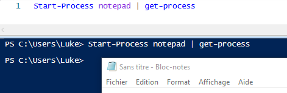

# Pipeline

 **Qu'est ce qu'un pipeline :** un pipeline est une série de commandes connectées par des opérateurs de pipeline (|). 
 Ces opérateurs vont donc envoyer les résultats de la première commande à la suivante. 

 - Exemple :

> 

-> **Mon script** à "start-process" donc lancer le protocole qui est d'ouvrir "notepad" et avec le pipeline l'information est donc envoyé dans la commande "get-process". Le "get-process" à ouvert "notepad". 