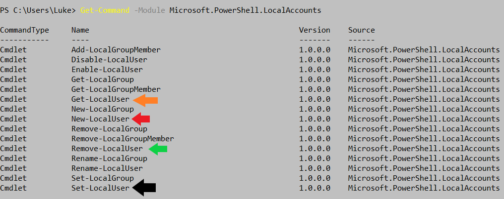

# Script de gestion des comptes utilisateurs 

Les consignes du TP sont : 

>**Faire un script de gestion des utilisateurs, qui doit permettre :** 
-de créer des utilisateurs
-de modifier des utilisateurs
-de supprimer des utilisateurs
-de voir tous les utilisateurs
-de faire une recherche sur l'existence d'un utilisateur en particulier

Source utilisée :https://blog.netwrix.fr/2019/01/16/comment-ajouter-supprimer-et-modifier-des-utilisateurs-et-groupes-locaux-avec-powershell/

---
## Défénir les commandes 
- Premièrement nous allons défénir ce que sont les commandes au-dessus :
> **1- Créer des utilisateurs ->** ***"New-LocalUser"***
> 
> **2- Modifier des utilisateurs ->** ***"Set-LocalUser"***
> 
> **3- Supprimer des utilisateurs ->** ***"Remove-LocalUser"***
> 
> **4- Voir tout les utilisateurs ->** ***"Get-LocalUser"***
>
> **5- Faire une recherche sur l'existence d'un utilisateur en particulier ->** ***"Get-LocalUser -Name ‘guest’ | Select-Object *"*** 

- On peut trouver toutes ces commandes avec une commande toute simple : 
> **Get-Command -Module Microsoft.PowerShell.LocalAccounts**

>

---
## Le script 

> 

