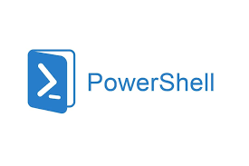

# 

## Qu'est ce que Powershell 
- **PowerShell** est une infrastructure multiplateforme. Elle permet la gestion de la configuration et de l'automatisation des tâches. Elle est aussi composée d'un interpréteur de commandes (shell) de ligne de commande et d'un langage de script.
---
## Sommaire 
1. [L'histoire de Powershell](https://github.com/Luke859/Linux/blob/main/Histoire%20de%20Powershell.md)

2. [Comment installer Powershell](https://github.com/Luke859/Linux/blob/main/Comment%20installer%20Powershell%20sur%20Windows%20et%20Linux.md)

### Les commandes Powershell 

1. [Nom des commandes](https://github.com/Luke859/Linux/blob/main/Nom%20des%20commandes.md)

2. [Les commandes d'aide](https://github.com/Luke859/Linux/blob/main/Les%20commandes%20aides.md)

3. [Les alias de commande](https://github.com/Luke859/Linux/blob/main/Alias%20des%20commandes.md)

4. [Commandes Powershell](https://github.com/Luke859/Linux/blob/main/Commandes%20Powershell.md)

5. [Les Variables, leur type et stocker](https://github.com/Luke859/Linux/blob/main/Variables%2C%20type%2C%20stocker.md)
    
    - [Le type de la variable](https://github.com/Luke859/Linux/blob/main/Variables%2C%20type%2C%20stocker.md)
    - [Les différents types de variables](https://github.com/Luke859/Linux/blob/main/Variables%2C%20type%2C%20stocker.md)
    - [Stocker une commmande dans une variable](https://github.com/Luke859/Linux/blob/main/Variables%2C%20type%2C%20stocker.md)

6. [Les boucles](https://github.com/Luke859/Linux/blob/main/8-Boucles.md)

7. [Images utilisées](https://github.com/Luke859/Linux/tree/main/Images.md)
